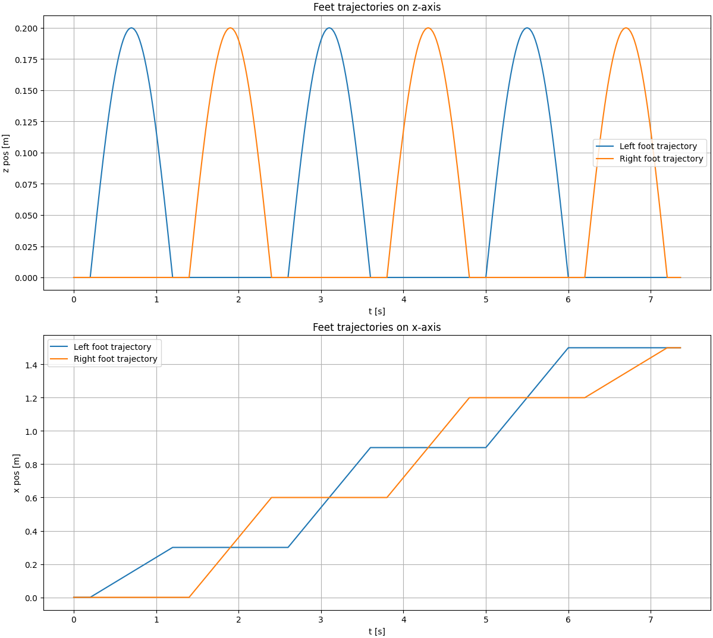

# LIPM Walking Controller

[](https://github.com/rdesarz/lipm-walking-controller/actions/workflows/build.yml)

This repository presents an open-source implementation of the **Linear Inverted Pendulum Model (LIPM)** walking pattern 
generator based on **preview control of the Zero-Moment Point (ZMP)**, following the formulation introduced 
by _Kajita et al., “Biped Walking Pattern Generation by Using Preview Control of the Zero-Moment Point,” ICRA 2003_.

---

## Introduction

Humanoid walking requires the generation of dynamically stable trajectories of the Center of Mass (CoM) with 
respect to the Zero-Moment Point (ZMP). This project implements the **discrete-time LIPM** dynamics and 
the associated **optimal preview control law**, reproducing the approach used in model-based humanoid locomotion 
control. The framework includes visualization and inverse kinematics modules, enabling reproducible experiments 
on trajectory generation and tracking. 

---

## Overview

The objective is to reproduce and analyze the ZMP preview control pipeline:

- Model the robot’s CoM using the 3D LIPM  
- Compute optimal CoM trajectories given a reference ZMP sequence using preview control 
- Generate and visualize corresponding foot trajectories
- Apply inverse kinematics to produce consistent joint motions  

The implementation prioritizes **clarity** and **experimental reproducibility**, making it suitable for education
purpose.

---

## Methodology

### Linear Inverted Pendulum Model

The CoM motion is modeled by the discrete-time linearized dynamics of the inverted pendulum:

$$
\ddot{x}_c = \frac{g}{z_c} (x_c - x_z)
$$

where $x_z$ denotes the ZMP, $x_c$ the CoM projection, and $z_c$ the constant CoM height.

### Preview Control

The control input minimizes a quadratic cost over a finite horizon:

$$
J = \sum_{k=0}^{\infty} \left( Q_e e_k^2 + x_k^T Q_x x_k + R \Delta u_k^2 \right)
$$

yielding a feedback + integral + preview law.  
The resulting controller anticipates future ZMP references, ensuring stable walking trajectories.

---

## Features

- Discrete-time 3D LIPM formulation  
- Full preview controller (state feedback, integral, preview gain)  
- Configurable parameters: preview horizon and weights on integral error, state and input variation $Q_e$, $Q_x$, $R$  
- Visualization of CoM/ZMP trajectories and foot motion  
- Inverse kinematics tracking using the Talos humanoid model  

---


## Examples

Before running an example, clone the repository and install the dependencies:

```bash
git clone https://github.com/rdesarz/lipm-walking-controller.git
cd lipm-walking-controller
pip install ".[dev]"
```

### Example 1: Preview Control Demonstration

This experiment demonstrates the LIPM preview control generating a stable CoM trajectory tracking a predefined ZMP reference.

```bash
python examples/example_1_lipm_preview_control.py
```


### Example 2: Preview Control Demonstration

Linear forward motion with sinusoidal vertical swing.



```bash
python examples/example_2_feet_motion.py
```

### Example 3: Preview Control Demonstration

Inverse kinematics are computed to track CoM and foot trajectories using the Talos model.
This produces a full kinematic walking sequence without dynamic simulation.

```bash
python examples/example_3_walk_inverse_kinematic.py
```

## Future Work

The next steps aim at extending this framework toward dynamically consistent humanoid walking:

* Integration with PyBullet for physics-based evaluation
* Disturbance rejection analysis under external perturbations
* Development of a footstep planner for omnidirectional locomotion 
* Integration of Model Predictive Control (MPC) for real-time trajectory optimization

## References

- Kajita, S., Kanehiro, F., Kaneko, K., Fujiwara, K., Harada, K., Yokoi, K., & Hirukawa, H.  
  *Biped Walking Pattern Generation by Using Preview Control of Zero-Moment Point.*  
  *Proceedings of the IEEE International Conference on Robotics and Automation (ICRA), 2003.*

- Katayama, T., Ohki, T., Inoue, T., & Kato, T.  
  *Design of an Optimal Controller for a Discrete-Time System Subject to Previewable Demand.*  
  *International Journal of Control*, vol. 41, no. 3, pp. 677–699, 1985.

- Caron, S.  
  *Jacobian of a kinematic task and derivatives on manifolds.*  
  Available online at  [https://scaron.info/robotics/jacobians.html](scaron.info/robotics/jacobian-of-a-kinematic-task-and-derivatives-on-manifolds.html), accessed 2025.  
  (Detailed explanations and examples for frame kinematics, Jacobian computation, and task-space control using Pinocchio.)
