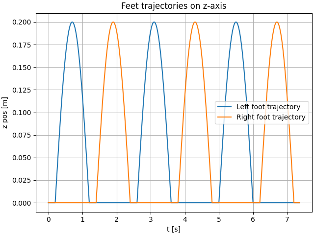

# LIPM Walking Controller

[](https://github.com/rdesarz/lipm-walking-controller/actions/workflows/build.yml)

This repository presents an open-source implementation of the **Linear Inverted Pendulum Model (LIPM)** walking pattern 
generator based on **preview control of the Zero-Moment Point (ZMP)**, following the formulation introduced 
by _Kajita et al., “Biped Walking Pattern Generation by Using Preview Control of the Zero-Moment Point,” ICRA 2003_.

The animation below shows the controller in action in a Pybullet simulation:

<p align="center">
  
</p>


---

## Introduction

Humanoid walking requires the generation of dynamically stable trajectories of the Center of Mass (CoM) with 
respect to the Zero-Moment Point (ZMP). This project implements the **discrete-time LIPM** dynamics and 
the associated **optimal preview control law**, reproducing the approach used in model-based humanoid locomotion 
control. The framework includes controller and inverse kinematics modules. The controller is tested in simulation using 
Pybullet, enabling reproducible experiments on trajectory generation and tracking. 

---

## Overview

The objective is to reproduce and analyze the ZMP preview control pipeline:

- Model the robot’s CoM using the 3D LIPM
- Compute optimal CoM trajectories given a reference ZMP sequence using preview control 
- Generate corresponding foot trajectories
- Apply inverse kinematics to produce consistent joint motions
- Apply computed joint positions to the simulated robot in Pybullet

The implementation prioritizes **simplicity** and **experimental reproducibility**, making it suitable for education
purpose.

---

## Methodology

### Zero Moment Point and Balance Criterion

The Zero Moment Point (ZMP) is the point on the ground where the resultant contact forces between the feet and the 
ground produce no moment about the horizontal axes. To maintain balance, the ZMP must remain within the robot’s support 
polygon, defined as the convex hull of the contact areas of the feet. Intuitively, this ensures that the ground reaction
forces can generate a counteracting moment to keep the feet flat and prevent tipping, maintaining dynamic equilibrium.
For a more thorough explanation I recommend [this blog post](https://scaron.info/robotics/zero-tilting-moment-point.html) by Stéphane Caron.

### Linear Inverted Pendulum Model

The first step of the controller is to define a reference ZMP trajectory, alternating from one foot to the other at each step.
The objective is to establish a relationship between the position of this reference ZMP and the robot’s Center of Mass (CoM).
This relationship can be derived from a simplified model of the robot’s dynamics known as the Linear Inverted Pendulum Model (LIPM).

The LIPM is derived under the following assumptions:

* The mass of the body is concentrated at a single point, the Center of Mass (CoM).  
* Legs are massless and do not contribute to the system dynamics.  
* The CoM moves on a horizontal plane at a constant height, eliminating vertical motion coupling.  
* No angular momentum is generated about the CoM, meaning the upper body remains still to avoid producing additional moments.

Under these assumptions and for small angles, the inverted pendulum dynamics can be linearized, leading to the following second-order linear equation:

$$
\ddot{x}_c = \frac{g}{z_c} (x_c - x_z)
$$

where $x_z$ denotes the ZMP, $x_c$ the CoM projection, and $z_c$ the constant CoM height.

### Preview Control

In Kajita's paper, the idea is to use a preview control in order to track and anticipate the ZMP reference change.
The control input minimizes a quadratic cost over a finite horizon:

$$
J = \sum_{k=0}^{\infty} \left( Q_e e_k^2 + x_k^T Q_x x_k + R \Delta u_k^2 \right)
$$

yielding a feedback + integral + preview law.  
The resulting controller anticipates future ZMP references, ensuring stable walking trajectories.

The result of the preview controller can be observed with the first example provided in the repository.

### Swing foot trajectory generation

Walking is organized into fixed-duration phases: Single Support (SS) and Double Support (DS). In SS one foot is the 
swing foot and the other is the stance foot; in DS both feet are in contact and no swing foot exists. The swing foot 
horizontal position follows a sinusoidal time law along the world x-axis from $x_0$ to $x_1$ over duration $T_SS$. 
The lateral position $y$ stays constant. The vertical motion is a simple bump with peak clearance $h$ above the ground
reference, returning to the ground at touchdown. Foot orientation is kept constant with yaw=0; 
the sole remains parallel to the floor. All phase durations are configurable.

The figure below shows the generated trajectory for both foot with a height of 20cm:

<p align="center">
  
</p>

### Inverse Kinematics


### Integration in PyBullet

---

## Features

- Discrete-time 3D LIPM formulation  
- Full preview controller (state feedback, integral, preview gain)  
- Configurable parameters: preview horizon and weights on integral error, state and input variation $Q_e$, $Q_x$, $R$  
- Visualization of CoM/ZMP trajectories and foot motion  
- Inverse kinematics tracking using the Talos humanoid model  

---


## Installation

Docker is recommended to run the examples. Here are the commands that you need to setup the project:

```bash
git clone https://github.com/rdesarz/lipm-walking-controller.git
cd lipm-walking-controller
docker build -t lipm-walking-controller .
```

### Example 1: Preview Control Demonstration

This experiment demonstrates the LIPM preview control generating a stable CoM trajectory tracking a predefined ZMP reference.

```bash
docker run --rm -it lipm-walking-controller python examples/example_1_lipm_preview_control.py
```


### Example 2: Swing foot trajectory generation 

Linear forward motion with sinusoidal vertical swing.

```bash
docker run --rm -it lipm-walking-controller python examples/example_2_feet_motion.py
```

<p align="center">
  
</p>

### Example 3: Inverse kinematics

Inverse kinematics are computed to track CoM and foot trajectories using the Talos model.
This produces a full kinematic walking sequence without dynamic simulation.

```bash
docker run --rm -it -p 7000:7000 -p 6000:6000 lipm-walking-controller python examples/example_3_walk_inverse_kinematic.py --path-talos-data "/"
```

<p align="center">
  
</p>

### Example 4: Integration in Pybullet

In this example we integrate the controller and inverse kinematic modules inside Pybullet to test the walking pattern in
a simulated environment:

```bash
docker run --rm -it --env DISPLAY -v /tmp/.X11-unix:/tmp/.X11-unix:ro --device /dev/dri:/dev/dri lipm-walking-controller python examples/example_4_physics_simulation.py --path-talos-data "/"
```

<p align="center">
  
</p>


## Future Work

The next steps aim at extending this framework toward dynamically consistent humanoid walking:

* Disturbance rejection analysis under external perturbations
* Development of a footstep planner for omnidirectional locomotion 
* Improvement of the swing foot trajectory generation to improve contact phase with the floor
* Integration of Model Predictive Control (MPC) for real-time trajectory optimization

## References

- Kajita, S., Kanehiro, F., Kaneko, K., Fujiwara, K., Harada, K., Yokoi, K., & Hirukawa, H.  
  *Biped Walking Pattern Generation by Using Preview Control of Zero-Moment Point.*  
  *Proceedings of the IEEE International Conference on Robotics and Automation (ICRA), 2003.*

- Katayama, T., Ohki, T., Inoue, T., & Kato, T.  
  *Design of an Optimal Controller for a Discrete-Time System Subject to Previewable Demand.*  
  *International Journal of Control*, vol. 41, no. 3, pp. 677–699, 1985.

- Caron, S.  
  *Jacobian of a kinematic task and derivatives on manifolds.*  
  Available online at  [https://scaron.info/robotics/jacobians.html](scaron.info/robotics/jacobian-of-a-kinematic-task-and-derivatives-on-manifolds.html), accessed 2025.  
  (Detailed explanations and examples for frame kinematics, Jacobian computation, and task-space control using Pinocchio.)
