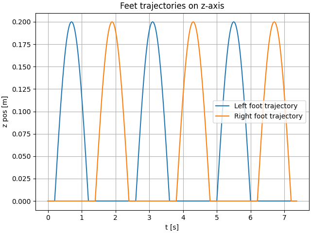

# Foot trajectory generation

## Swing foot trajectory generation

Walking is organized into fixed-duration phases: **Single Support (SS)** and **Double Support (DS)**. In Single Support, one foot is the 
**swing foot** and the other is the **stance foot**. In Double Support both feet are in contact and no swing foot exists. The timing of each 
phase is related to the trajectory of the ZMP. During Single Support phase, the ZMP position is maintained over the stance
foot. During Double Support phase, the ZMP position moves from a foot to another.
Currently, the swing foot horizontal position follows a sinusoidal time law along the world x-axis from $x_0$ to $x_1$ 
over duration $T_{SS}$. 
The lateral position $y$ stays constant. The vertical motion is a simple bump with peak clearance $h$ above the ground
reference, returning to the ground at touchdown. Foot orientation is kept constant with yaw=0; 
the sole remains parallel to the floor. All phase durations are configurable.

The figure below shows the generated trajectory for both foot with a height of 20cm:

<p align="center">
  
</p>

## Example

You can reproduce the example displayed on the figure by launching the script `example_2_feet_motion.py`. We 
recommend you to use Docker as explained in the installation part:

```bash
xhost +local:root
docker run --rm -it \
  --env DISPLAY \
  -v /tmp/.X11-unix:/tmp/.X11-unix:ro \
  --device /dev/dri:/dev/dri \
  biped-walking-controller \
  python examples/example_2_feet_motion.py 
```

The parameters used in this script are the following:

```python
dt = 0.005  # Delta of time of the model simulation
t_ss = 0.7  # Single support phase time window
t_ds = 0.8  # Double support phase time window
t_init = 2.0  # Initialization phase (transition from still position to first step)
t_end = 2.0 # Final phase (transition from walking to standstill position)
lf_initial_pose = np.array([0.0, 0.1, 0.0]) # Initial position of the left foot
rf_initial_pose = np.array([0.0, -0.1, 0.0]) # Initial position of the right foot
n_steps = 5 # Number of steps
l_stride = 0.3 # Length of the stride
max_height_foot = 0.2 # Maximal height of the foot during motion of the swing foot
```

# Code API

::: biped_walking_controller.foot
    options:
      members_order: source
      heading_level: 2