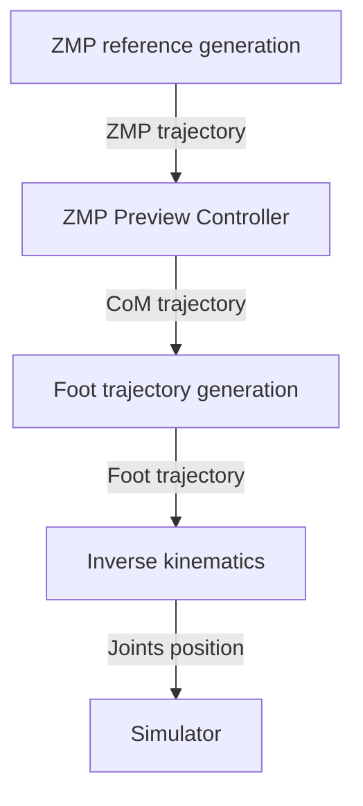

# Biped Walking Controller

This project presents an open-source Python implementation of the **Linear Inverted Pendulum Model (LIPM)** walking pattern 
generator based on **preview control of the Zero-Moment Point (ZMP)**, following the formulation introduced 
by _Kajita et al., “Biped Walking Pattern Generation by Using Preview Control of the Zero-Moment Point,” ICRA 2003_.

The animation below shows the controller in action in a Pybullet simulation:

  

## Overview

The objective is to reproduce and analyze the ZMP preview control pipeline:

- Model the robot’s CoM using the 3D LIPM
- Compute optimal CoM trajectories given a reference ZMP sequence using preview control 
- Generate corresponding foot trajectories
- Apply inverse kinematics to produce consistent joint motions
- Apply computed joint positions to the simulated robot in Pybullet

The different steps are represented by the figure below:

The implementation prioritizes **simplicity** and **experimental reproducibility**, making it suitable for education
purpose. It relies on [Pinocchio](https://github.com/stack-of-tasks/pinocchio) to handle the kinematics of the robot and
[PyBullet](https://pybullet.org/wordpress/) for physics simulation.